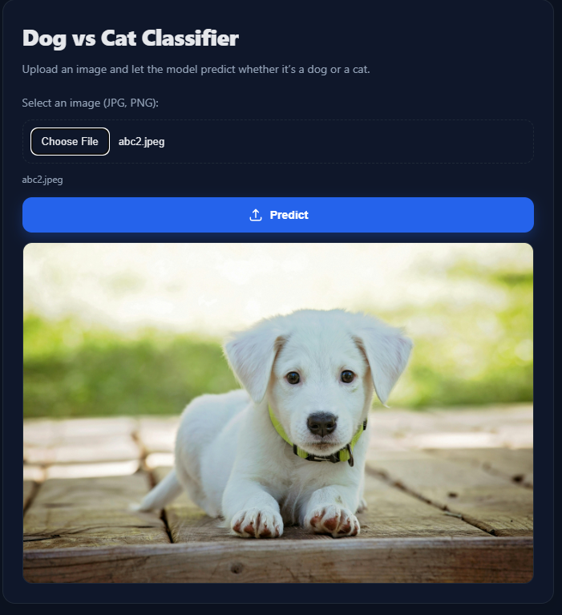
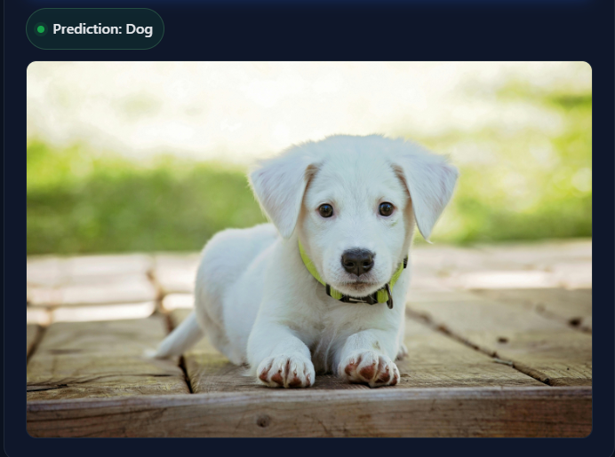

# Dog vs Cat Image Classifier  

A deep learning web application that classifies whether an uploaded image is of a **Dog** or a **Cat** .  
This project is built using **TensorFlow, Flask, HTML, CSS, and JavaScript**.  

🔗 **Live Demo (Coming Soon after Deployment)**  

---

## 📌 Features  
- Upload any Dog or Cat image.  
- The model predicts whether the image is of a dog or a cat.  
- Simple, clean, and responsive frontend.  
- Built **from scratch (no pre-trained models used)** – implemented using CNN logic.  
- Restriction: The app only accepts **dog and cat images**.  

---

## Tech Stack  
- **Backend**: Flask (Python)  
- **Frontend**: HTML, CSS, JavaScript  
- **Model**: TensorFlow & Keras (Custom CNN)  
- **Deployment**: Render & Hugging Face Spaces  

---

## Model Download  
Since the `.h5` model file is hosted on Hugging Face.  

👉 [Download Model (dog_cat_model.h5)](https://huggingface.co/Subhankar002/dog-vs-cat-classifier/resolve/main/dog_cat_model.h5)  

In `app.py`, the model will automatically load from this link if not found locally.  

---

Screenshots

Upload Section

Result Section

About
This project is part of my Deep Learning experiments.
No pre-trained model was used (like VGG16, ResNet, etc.).
CNN was designed and trained manually.
Accuracy achieved: 83%
Future goal: Optimize and reach 95%+ accuracy.

Author:- Subhankar Saha
Portfolio(https://subhankar0002.github.io/My-portfolio/)
LinkedIn(https://www.linkedin.com/in/subhankar0002/)

License
© 2025 Future Innovator. All Rights Reserved.